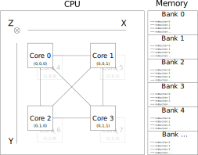

# LAVAL COMPUTER reference manual

## Introduction
LAVAL COMPUTER is the first computer to implement the revolutionary LAVAL CPU architecture.
Like every good acronym, LAVAL is recursively defined: Laval Advanced Vectorized Architecture Laboratory.

Its a novel architecture, sets to revolutionize the computing world with its massively parallel cores organisation.

## Architecture

LAVAL architecture lies somewhere between those of CPU, GPU and FPGA.
It consists of a large number of simple locally connected cores.
Core are connected together in a local basis following a cube pattern.
Cores execute instructions stored in their linked memory bank.
Branches are made by switching execution from one memory bank to another one.



### Core
The main component of the LAVAL architecture is the CORE unit.
It is a very low complexity core capable of executing a couple of different 8 bits instructions *arguments included*.

Execution takes place in two steps:

1. Preload

    1. If multiplexer' target core have its SYNC flag off, then this step is done
    2. Load a value from the multiplexer into PRELOAD.
    3. Set UNLOCK flag on multiplexer target if the next instruction to be executed will use PRELOAD


2. Fetch and execute

    1. Reset SYNC flag
    2. Execute instruction
        Instruction may or may not stall the execution pipeline for this core, refer to the instruction set documentation for further information.
    3. PC is incremented and may freely wrap around
    4. Reset UNLOCK flag

This means each core is able to read
Inter-core communication is heavily optimized for constant patterns.
Reads take place using a multiplexer whose address can only be changed using dedicated instructions.


#### VAL register


#### MUX register
Two cores loading at the same time ...


#### Status register

#### PC register

### Memory bank


## Instruction set
TODO: Add instruction effect on status bits

### Basic instructions

#### NOP
No operation

**Argument:** None

**Description:**

Do nothing for one cycle


#### SYN
Sync

**Argument:** None

**Description:**

Sync VAL with connected mux(es).
Multiple cores may receive the same synced value as long as they fetch it on the same cycle.
This instruction will block until at least one core has fetched a value.


#### DBG
Output to debugger


**Argument:** None

**Description:**

Output core status, which the values of all the registers, to connected debugger.


#### HLT
Halt

**Argument:** None

**Description:**

Stop CPU execution and return VAL. Two cores returning at the same time return an undefined VAL.


#### HCF
**Argument:** None

**Description:**

???


### Controlling mux
#### MUX
Set multiplexer to another core

**Arguments:**

| Size | Description          |
|:---:|:-------------------|
| 0..2 | Offset on dimension 0 |
| 0..2 | Offset on dimension 1 |
| 0..2 | Offset on dimension 2 |

**Description:**

Point mux to another core as indicated by arguments by setting the MUX register.

**Notes:**
A core may be connected to itself.

**Example:**

```
MUX CURRENT, BEFORE, AFTER
```


#### CTC
Connect to carry

**Argument:** None

**Description:**

**Notes:**

The multiplexer may also be connected to the VAL register using CTV.


#### CTV
Connect to VAL

**Argument:** None

**Description:**

**Notes:**

The multiplexer may also be connected to the carry bit using CTC.


### Reading from mux
#### MXD
Multiplexer discard

**Argument:** None

**Description:**

Fetch and discard a value from the mux. Use this instruction to unlock a core blocked on a SYN instruction.

**Notes:**
This instruction keeps VAL unaffected.

**Example:**

```
.cores 1, 1, 2
.mem_number 2
.mem_size 3
.core_to_mem 0, 1

0:
    LCL 1
    SYN     ; Will wait here for one cycle, the execute on the next
    LCL 2   ; Will execute on the fourth cycle

1:
    NOP
    NOP
    MXD     ; VAL is still zero
```


#### MXL
Multiplexer load

**Argument:** None

**Description:**

Fetch and load into VAL the value from mux.


#### MXA
Multiplexer addition

**Argument:** None

**Description:**

Fetch and add the value from the mux to VAL.


#### MXS
Multiplexer subtraction

**Argument:** None

**Description:**

Fetch and subtract the value from the mux to VAL.


### Jumping
#### JMP
Jump unconditionally

**Argument:**

| Size | Description       |
|:---:|:-----------------|
| 0..15 | Membank id |

**Description:**

Point current core to a new membank as indicated by the argument. PC is reset to 0.

**Example:**

```
.cores 1, 1, 1
.mem_number 2
.mem_size 2
.core_to_mem 0, 1

0:
    NOP     ; First cycle.
    JMP 1   ; Second cycle.

1:
    NOP     ; Third cycle.
```


#### JLZ
Jump if less than zero

**Argument:**

| Size | Description       |
|:---:|:-----------------|
| 0..15 | Membank id |

**Description:**

Point current core to a new membank as indicated by the argument if VAL if less than 0. PC is reset to 0.


#### JEZ
Jump if equal to zero

**Argument:**

| Size | Description       |
|:---:|:-----------------|
| 0..15 | Membank id |

**Description:**

Point current core to a new membank as indicated by the argument if VAL if equal to 0. PC is reset to 0.


#### JGZ
Jump if greater than zero

**Argument:**

| Size | Description       |
|:---:|:-----------------|
| 0..15 | Membank id |

**Description:**

Point current core to a new membank as indicated by the argument if VAL if greater than 0. PC is reset to 0.


### Using constants
#### LCL
Load constant into low part

**Argument:** None

| Size | Description       |
|:---:|:-----------------|
| 0..15 | Value to load |

**Description:**

Load a 4 bits constant into the 4 lower bits of VAL.
The four higher bits are unaffected.

**Notes:**

To load the higher bits, use LCH.


#### LCH
Load constant into high part

**Argument:** None

| Size | Description       |
|:---:|:-----------------|
| 0..15 | Value to load |

**Description:**

Load a 4 bits constant into the 4 higher bits of VAL.
The four lower bits are unaffected.

**Notes:**

To load the lower bits, use LCL.


#### LSL
Logical shift, left

**Argument:** None

| Size | Description       |
|:---:|:-----------------|
| 0..15 | Value to shift by |

**Description:**

Logically left shift VAL by number of bits indicated by the argument.
Every bit of VAL is moved a given number of bit positions.
The vacant bit-positions are filled with zeros.
Does not preserve a number's sign bit, if applicable.


#### LSR
Logical shift, right

**Argument:** None

| Size | Description       |
|:---:|:-----------------|
| 0..15 | Value to shift by |

**Description:**

Logically right shift VAL by number of bits indicated by the argument.
Every bit of VAL is moved a given number of bit positions.
The vacant bit-positions are filled with zeros.
Does not preserve a number's sign bit, if applicable.


#### CAD
Constant addition

**Argument:** None

| Size | Description       |
|:---:|:-----------------|
| 0..15 | Value to add |

**Description:**

Add a constant to VAL.


#### CSU
Constant subtraction

**Argument:** None

| Size | Description       |
|:---:|:-----------------|
| 0..15 | Value to subtract |

**Description:**

Subtract a constant to VAL.


#### CAN
Constant AND

**Argument:** None

| Size | Description       |
|:---:|:-----------------|
| 0..15 | Second AND operand |

**Description:**

Apply a logical AND to the four lower bits of VAL. The 4 higher bits are cleared.


#### COR
Constant OR

**Argument:** None

| Size | Description       |
|:---:|:-----------------|
| 0..15 | Second OR operand |

**Description:**


The COR instruction is unable by itself to affect all the bits of VAL.
A single COR will apply a logical OR to the four lower bits of VAL. The 4 higher bits are kept unmodified.
It may be useful to then use the CAN instruction to restrict output to affected values.


## Simulator


## LAVAL-M
LAVAL-M1 is the first version of the official embedded subset of LAVAL.
It imposes some restriction garantee a very low memory requirement, power consumption and an high AL<sup>[1](#AL)</sup>.

- It possesses a single general purpose register
- It only supports integer math
- All its registers are 8 bits long
- Since PC is 8 bits long, memory banks are limited to 256 bytes
-

TODO: two complement

TODO: Signed behaviours:
- Shifts
- Overflows

<a name="AL">1. </a>Annoyance level: Defined as (1 - Percentage of student who would repeat their programming experiments with the CPU architecture)

